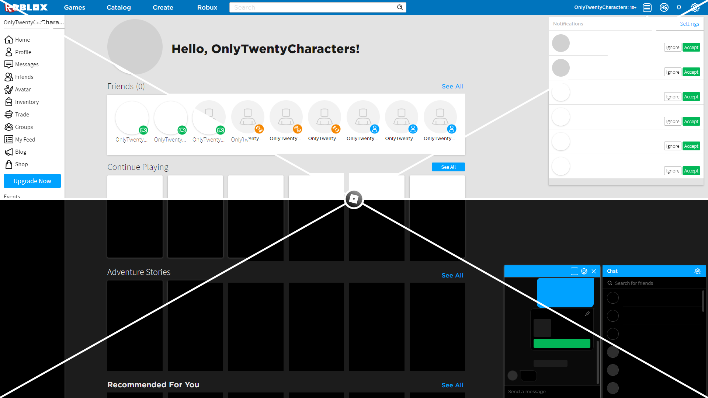

# Roblox Legacy Old Theme
**[Roblox Legacy Old Theme](https://userstyles.world/style/5399/)** is a theme for [stylus](https://add0n.com/stylus.html) (see [Installation](#Installation) for installation details) that brings back the 2019 theme primarily from June - September 2019 with customizable options for the end user.

    

## Community
Roblox Legacy Old Theme now has a discord server! You must be 13 years or older to join.
 
You can join using the invite url [here](https://discord.gg/sXZkehbWh6).

## Features
- Highly Customizable :
  - Badge Style
    - 201309
    - 201410
    - 201501
    - 201509
    - 201511
    - 201701
    - 201903 <b>`Default`</b>
  - Box Shadows
  - Brighter Dark Theme colors <b>`Default`</b>
  - Crop Wide Gamecard Thumbnails <b>`Default`</b>
  - Currency Brand Style
    - Robux <b>`Default`</b>
    - Tickets
  - Custom Site Theme
    - None <b>`Default`</b>
    - April_Fools
    - BloxTober
    - BTR_Night
    - BTR_Red
    - BTR_Simblk
    - BTR_Sky
    - L_Red
    - RPlus_Easter
    - RPlus_OBC
  - Force Light Theme on signup
  - Five column Avatar Editor <b>`Default`</b>
  - Fixed 2019M Item Card Transitions
  - Gotham Font Fixes
  - Greeting Text Style
    - None <b>`Default`</b>
    - Hello
    - HelloExclamation
    - Exclamation
  - Item Card Style
    - Pre-2018
    - 2019E
    - 2019M <b>`Default`</b>
    - 2019L
  - Legacy Game Headers (BTRoblox)
  - Legacy Home Titles
  - Legacy Footer Text
    - None <b>`Default`</b>
    - BrandSync
    - 201401
    - 201501
    - 201601
    - 201607
    - 201601
    - 201701
    - 201706
    - 201801
    - 201811
    - 201901
  - Legacy Next StyleGuide
    -  ↳ Capital Brand Text in Modals
    -  ↳ Chat Party icon
    -  ↳ Chat Shadows <b>`Default`</b>
    -  ↳ Leaderboards tab
    -  ↳ Older
    -  ↳ Older Chat
    -  ↳ Remove Place name
    -  ↳ Remove Social Links
    -  ↳ Rename Chat to Chat & Party
  - My Avatar Gogo Spinner
  - Original Sponsor Size
  - Play Button Style
    - 201610
    - 201704
    - 201706
    - 201712
    - 201812
    - 201901
    - 201906 <b>`Default`</b>
    - 2020+
    -  ↳ Social media experiment type
      - None <b>`Default`</b>
      - share_icon
      - social_media
  - Restore Ads
    - None
    - Default <b>`Default`</b>
    - Filler
    -  ↳ Games Page
  - Restore legacy sidebar padding
  - Revert 201909+ updates <b>`Default`</b>
    -  ↳ Extras <b>`Default`</b>
    -  ↳ Rename Connections to Friends `Default`
  - Premium To BC
    -  ↳ Tier
      - BC <b>`Default`</b>
      - TBC
      - OBC
  - Site Brand Style
    - 201408
    - 201412
    - 201511
    - 201701 <b>`Default`</b>
  - Signup Theme
    - 2017
    - 2018 <b>`Default`</b>
    - 2019L
    - 2020+
  - Styleguide Page Theme
    - 2016
    - 2017
    - 2018 <b>`Default`</b>
  - Social Links Version
    - V1
    - V2 <b>`Default`</b>
    - V3
    - V3_1
    - V3_2
    - V4
    - V4_1
    -  ↳ Remove nondesigna­ted icons
  - Source Sans Pro Font
  - Transition animations <b>`Default`</b>
  - Use 2017 Red Branding (Messages / Bootstrapper)
  - Watermark Branch <b>`Experimental only`</b>
    - None
    - Developers <i>`Hidden`</i>
    - Testers <b>`Default`</b>
- Extension Support
  - Btroblox
  - Roblox+
  - Ropro
  - Roseal
  - Rogold
- Supports both Light and Dark themes.
- Supports low resolution devices and high PPI/DPI ([Pixels Per Inch](https://en.wikipedia.org/wiki/Pixel_density)/[Dots Per Inch](https://en.wikipedia.org/wiki/Dots_per_inch)) monitors.
- Supports touchscreen devices.

## Installation

Don't have stylus already installed? You can get it here for your browser :
- [Chromium Based Browsers](https://chrome.google.com/webstore/detail/stylus/clngdbkpkpeebahjckkjfobafhncgmne)
- [FireFox](https://addons.mozilla.org/en-US/firefox/addon/styl-us/?utm_source=addons.mozilla.org&utm_medium=referral&utm_content=search)

1. To install stylus, click the blue "Install/Get/Add" button, if you get a popup prompting to install stylus click "Add" (if you get another popup that it was successful click okay or the X button).
2. Once stylus is installed on your browser go to this [page](https://userstyles.world/style/5399/), on the themes page click the blue "Install" button which should take you to the Install page, here you can customize the theme to your choosing (if you do not see the customization options on the right, click the gear icon next to the gray "Install" button), once done, click the gray "Install Style" button and your done, you can confirm it's installed by going on [roblox.com](https://roblox.com/).

### Extras

For a better experience/accuracy with the theme you may try out [Legacy Site Restoration](https://github.com/tersiswilvin/Roblox-Legacy-Old-Theme/raw/refs/heads/Release/src/JS/LegacySiteRestoration.user.js) which requires [tampermonkey](https://www.tampermonkey.net/index.php#download) to use, if your unsure or confused with how to install please refer to tampermonkey's script [installation page](https://www.tampermonkey.net/faq.php?locale=en#Q102).

For upcoming updates and features you can try out the [beta](https://github.com/tersiswilvin/Roblox-Legacy-Old-Theme/raw/refs/heads/Beta/src/Channels/Beta/RLOT.user.css) channel, you're <ins>**not required**</ins> in any way to install this. Experimental channel may change at any time and or be unstable, any issues should be reported via [issues](https://github.com/tersiswilvin/Roblox-Legacy-Old-Theme/issues/new/choose).

## Issues

Please report any issues you find in [Issues](https://github.com/tersiswilvin/Roblox-Legacy-Old-Theme/issues/new/choose) or on the themes userstyles.world [page](https://userstyles.world/style/5399/) as well as any explanations/steps and a screenshot/video that could further help recreate the problem.

## Credits

Sites used to make this possible :
- [CodePen](https://codepen.io)
- [WayBack Machine](https://web.archive.org)
- [YouTube](https://www.YouTube.com)

Special thanks to those that helped make this theme possible.
