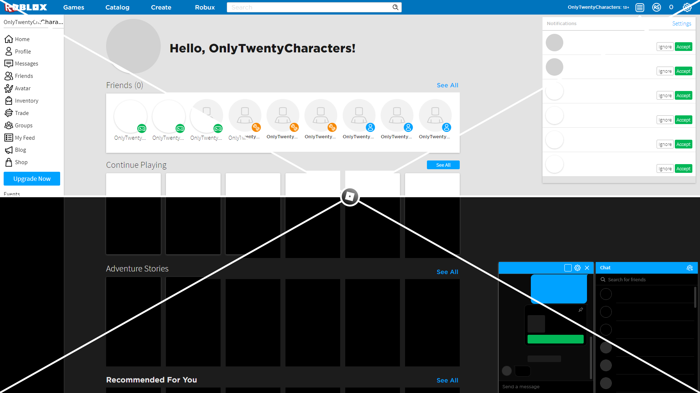

# Roblox Legacy Old Theme
**[Roblox Legacy Old Theme](//userstyles.world/style/5399/)** is a theme for [stylus](https://add0n.com/stylus.html) (see [Installation](#Installation) for installation details) that brings back the 2019 theme primarily from June - September 2019 with customizable options for the end user.

    

## Features
- Highly Customizable :
  - Badge Style.
  - Box Shadows.
  - Brighter Dark theme Colors.
  - Currency Brand Style.
  - Force light theme on signup.
  - Five column in Avatar Editor.
  - Greeting Text Style.
  - Item Card Style.
  - Custom Site Theme.
  - Legacy Game Headers (BTRoblox).
  - Legacy Footer Text.
  - Legacy Next Styleguide.
  - Original Sponsor Size (Deprecated).
  - Play Button Sizing.
  - Restore legacy sidebar padding.
  - Revert 2019L+ changes.
  - Premium To BC (BTRoblox).
  - Site Brand Style.
  - Signup Theme.
  - Styleguide Page Theme.
  - Source San Pro Font.
  - Transition animations.
  - Use 2017 Red icon logo.
- Extension support :
  - Btroblox
  - Roblox+
  - Ropro
  - Rogold
- Supports both Light and Dark themes.
- Supports low resolution devices and high PPI/DPI (Pixels Per Inch/Dots Per Inch) monitors.
- Supports touchscreen devices.

## Installation

If you don't have stylus already installed, you can get it here for your browser :
- [Chromium Based Browsers](//chrome.google.com/webstore/detail/stylus/clngdbkpkpeebahjckkjfobafhncgmne)
- [FireFox](//addons.mozilla.org/en-US/firefox/addon/styl-us/?utm_source=addons.mozilla.org&utm_medium=referral&utm_content=search)
- <s>[Opera](//addons.opera.com/extensions/details/stylus/)</s>

1. To install stylus, click the blue "Install/Get/Add" button, if you get a popup prompting to install stylus click "Add" (if you get another popup that it was successful click okay or the X button).
2. Once stylus is installed on your browser go to this [page](//userstyles.world/style/5399/), on the themes page click the blue "Install" button which should take you to the Install page, here you can customize the theme to your choosing (if you do not see the customization options on the right, click the gear icon next to the gray "Install" button), once done, click the gray "Install Style" button and your done, you can confirm it's installed by going on [roblox.com](//roblox.com/).

### Extras

For a better experience/accuracy with the theme you may try out [Legacy Site Restoration](//raw.githubusercontent.com/tersiswilvin/Roblox-2019-Old-Theme/Release/Dev/Master/src/JS/LegacySiteRestoration.JS) which requires [tampermonkey](//www.tampermonkey.net/index.php#download) (recommended) or [violentmoney](//violentmonkey.github.io/get-it/#stable-release) (not tested) to use, if your unsure or confused with how to install please refer to tampermonkey's script [installation page](//www.tampermonkey.net/faq.php?locale=en#Q102) or violentmonkey's script [installation page](//violentmonkey.github.io/guide/creating-a-userscript/).

For upcoming updates and features you can try out the [experimental](//github.com/tersiswilvin/Roblox-2019-Old-Theme/raw/Release/Dev/Experimental/src/RLOTExperimental.user.css) channel, you're <ins>**not required**</ins> in any way to install this. Experimental channel may change at any time and or be unstable, any issues should be reported via [issues](#Issues).

## Issues

Please report any issues you find in [Issues](//github.com/tersiswilvin/Roblox-2019-Old-Theme/issues) or on the themes userstyles.world [page](//userstyles.world/style/5399/), please include what build and or channel you're on, the browser you're were using when the problem occured, the page you were on when it happened, and any other explanations/steps that could further help recreate the problem.

## Credits

Sites used to make this possible :
- [CodePen](https://codepen.io)
- [WayBack Machine](https://web.archive.org)
- [YouTube](https://www.YouTube.com)

Special thanks to those that helped make this theme possible.
